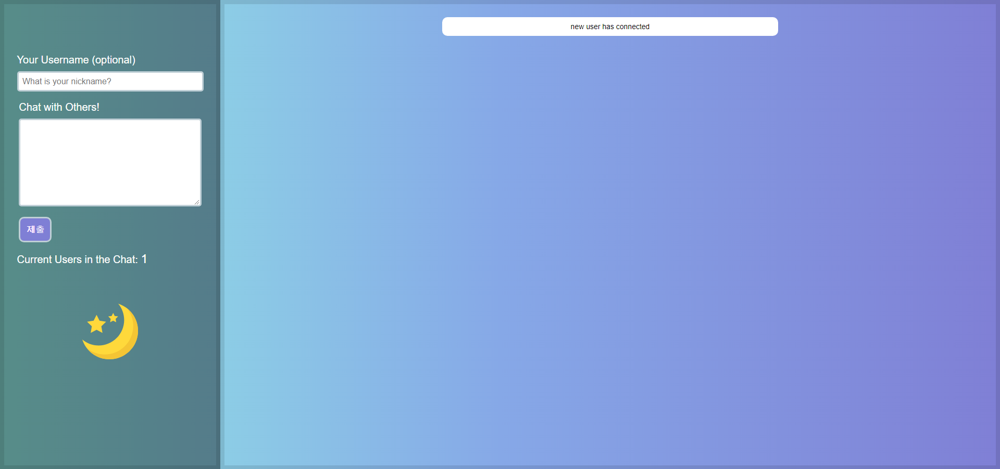
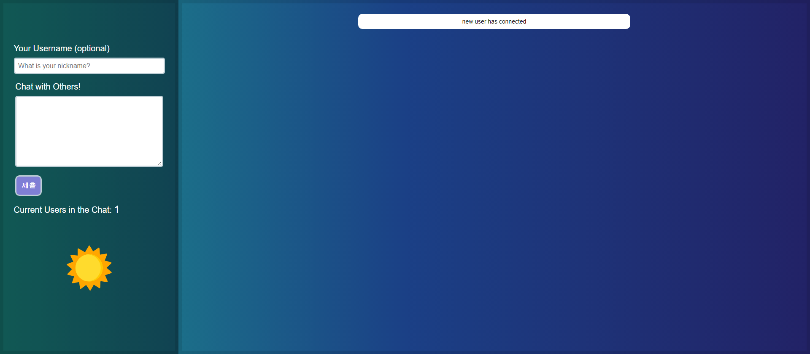

# Cho_J_ChatApplication

This Chat Application is built with socket.io for overall chat functionality, node.js to route, vue.js to build frame.
Heroku to have the application live on the web.

## To Start

`npm start` to enjoy the chat and customize it.

Or visit heroku live function to join the chat!: https://cho-j-chatapplication.herokuapp.com/

## Dark mode

Use dark mode to darken the background, incase you are using it at night or dark room.

## Development Tools

- SASS
- Node.js
- Vue.js
- socket.io
- GreenSock
- Waypoints

